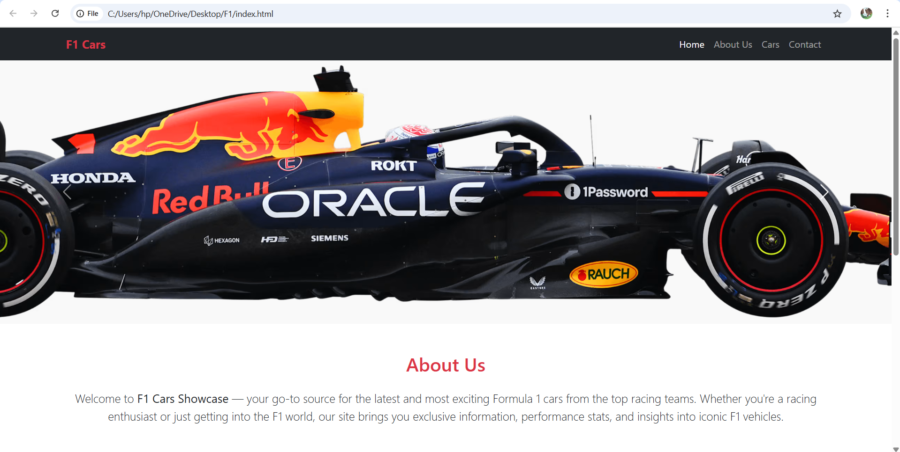

# 🏎️ F1 Cars Showcase

Welcome to **F1 Cars Showcase** — a stunning and interactive website built using **HTML**, **CSS**, **JavaScript**, and **Bootstrap 5** to highlight the most iconic Formula 1 cars. This site features a fixed-size image carousel, a responsive navbar, cards with car information, and a professional layout.

---

## 🌐 Live Site

---

## 🖼️ Screenshot

---

## 📁 Features

- 🚀 Bootstrap-powered responsive layout
- 🖼️ Fixed-size image carousel of F1 cars
- 🏎️ Stylish cards with info and external links to Ferrari, Red Bull, and Mercedes
- 🧭 Smooth navigation via sticky navbar
- 📄 About Us and Contact section
- ⚙️ Footer with contact and GitHub link

---

## 📦 Technologies Used

- HTML5
- CSS3
- JavaScript
- Bootstrap 5

---

## 📝 License
This project is licensed under the MIT License - see the LICENSE file for details.

---

# 📢 Note
This project is for educational and showcase purposes only. All car images and brand logos are property of their respective owners (F1, Ferrari, Red Bull Racing, Mercedes-AMG Petronas).

